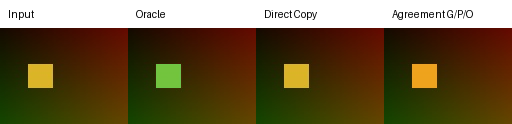

# SAM 2 handoff preview

- Source: `sam2.1-hiera-tiny`
- Target: `sam2.1-hiera-large`
- Translator: `direct_copy`
- Switch frame: `1`
- Mean binary IoU vs target-native: `0.0`
- Mean mask-logit MSE vs target-native: `1012647.9375`
- Wall time (seconds): `132.9875599`
- Peak CUDA memory (bytes): `None`

Green means both methods selected the pixel; pink is candidate-only; orange is oracle-only.

