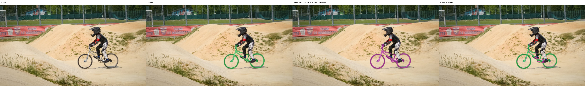
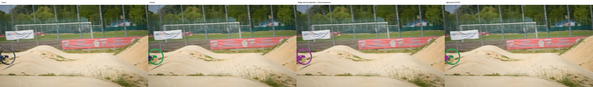
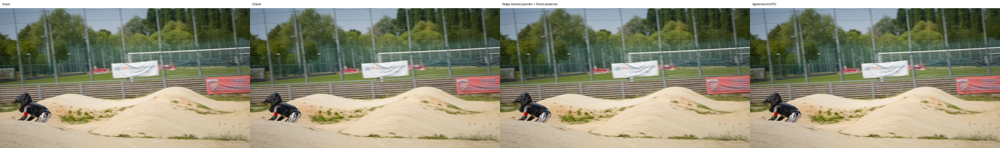
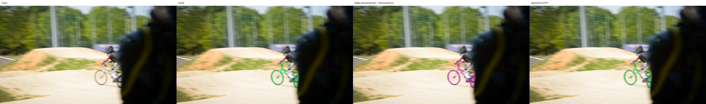

# SAM 2 handoff preview

- Source: `sam2.1-hiera-tiny`
- Target: `sam2.1-hiera-large`
- Translator: `ridge_spatial_pointer_direct_presence`
- Switch frame: `6`
- Mean binary IoU vs target-native: `0.9493896016398312`
- Mean mask-logit MSE vs target-native: `1.8786671569189393`
- Wall time (seconds): `91.91071961075068`
- Peak CUDA memory (bytes): `1660043264`

Green means both methods selected the pixel; pink is candidate-only; orange is oracle-only.

